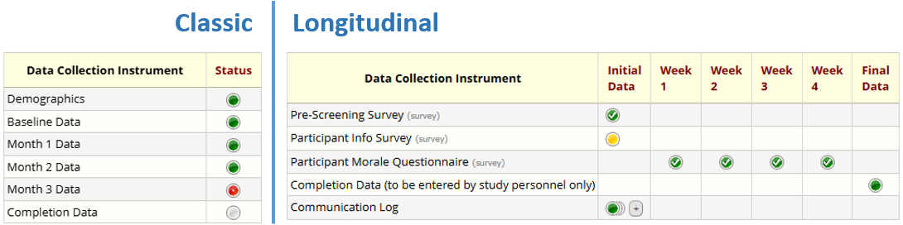
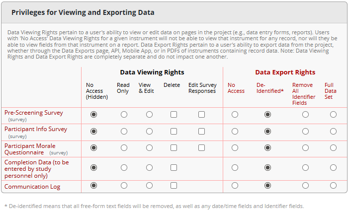
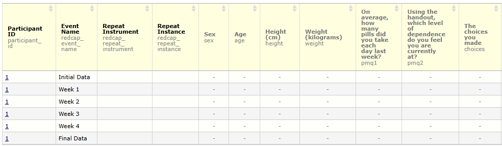
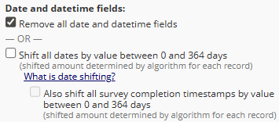
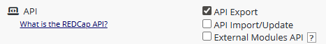
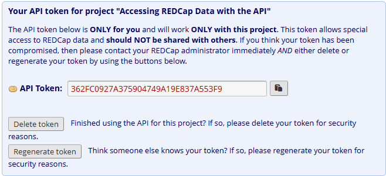

R and Python package for REDCap API (beginner level)
======

REDCapCon September 2025

- Shawn Garbett, Vanderbilt University, Dept of Biostatistics
- Günther Rezniczek, Ruhr-Universität Bochum, Dept of Obstetrics and Gynecology
- Will Beasley, University of Oklahoma, Office of Clinical Research Informatics

Follow along with us at
<https://github.com/OuhscBbmc/redcapcon-2025-r-api>

Agenda
------------

Total time: **70m**

1. Introductions 1m
1. Motivation (Günther) 5m
   1. vs csv
   1. vs writing your own R code with httr/RCurl
   1. Reproducibility!
1. Prereqs  (Günther)
    1. REDCap project exists
    1. user access to
    1. dev machine has R & redcapAPI/REDCapR
1. Basic Introduction redcapAPI/REDCapR (sg) 10m (unstructured)
1. Security (sg) 5m (shelter)
1. redcapAPI (sg) -- Type Theory (type casting) REDCapR/redcapAPI
1. Longitudinal (Will)
   1. Roll your own with redcapAPI/REDCapR
   1. REDCapTideR
1. Writing (brief -Will)
1. REDCap API 2.0 (Günther)
1. Further Resources (Will)
   1. Community is for REDCap admins, which many biostaticians are not
   1. [REDCap Tools](https://redcap-tools.github.io/projects/)
   1. Stack Overflow [redcap](https://stackoverflow.com/questions/tagged/redcap) tag
   1. Reddit [ProjectREDCap](https://www.reddit.com/r/ProjectREDCap/) subreddit
   1. Python and Ruby packages.
1. Closing
   1. API & Human Connections
   1. RAISE
   1. Security Committee
   1. Questions?

Motivation - Working with REDCap Data
------------

- REDCap is widely used for data collection in clinical & research contexts
- Once collected, the real work begins: _**analysis**_
- Key question:
  _How do you usually get your data out of REDCap?_

### CSV Export vs API Access - Two Different Worlds


**CSV Export**

- Manual download from REDCap
- Creates a **static snapshot** of the data
- Can include **all data** or a defined subset (report)
- Good for **one-time analyses** or data sharing
- No programming skills required
- Easy to open in Excel, SPSS, SAS, ...

**API Access**

- Connects directly to the REDCap project
- Always retrieves the **latest version** of the data
- Integrates into **R/Python scripts and workflows**
- Can also export reports programmatically
- Automates repetitive steps and reduces errors
- Ensures **reproducibility** through scripted pipelines

**Mixed / Hybrid Approach**

- **Exported CSVs** can be used as input for scripted pipelines
- Allows combining manual exports with automated analysis steps
- Reports can be exported both manually or via the API → more control from REDCap side
- Programmatic pipelines still ensure reproducibility

### The Concept of Living (Meta)Data

- REDCap projects **evolve continuously**:
  - New participants enrolled
  - Existing records updated
  - Data quality issues corrected*
  - **New fields or forms added** over time
- **CSV Export**
  - Provides only a **static snapshot** of data and metadata
  - Must be re-downloaded whenever project structure or data changes
  - Risk of outdated or inconsistent files
- **API Access**
  - Always pulls the latest data and metadata
  - Integrates directly into scripted workflows**
  - Supports reproducibility and automation even as the project changes**

- These issues could very well be detected through analyses _outside_ of REDCap
  - Of course, metadata changes may required the scripted pipeline to be adapted

### Why do we care?

**Reproducibility & Transparency**

- Data analyses should be:
  - _Reproducible_: same script = same results, anytime
  - _Transparent_: clear documentation of steps
- Using R scripts with API pulls:
  - analysis becomes a documented pipeline,
  - easier to share with collaborators,
  - simpler to audit or reproduce months later.

**Quality & Efficiency Benefits**

- Automated API workflows reduce risk of:
  - Using the wrong/outdated CSV version
  - Manual copy-paste errors
- Type consistency & controlled variable names directly from Codebook/API.
- Early data quality checks possible (missing data, unexpected values, etc.).

Thus, while CSV exports will always remain a valuable option, especially for quick checks, simple analyses, or collaboration with colleagues who prefer spreadsheets, they quickly reach their limits in projects where data and metadata keep evolving and frequent analyses need to be performed.

REDCap projects can be considered "living systems": both, data and metadata change over time. To keep up with these changes, reproducibility and automation become essential. Programmatic access via the API provides a reliable way to ensure that both data and metadata are always current, and that every step of the analysis can be repeated without guesswork.

Accessing REDCap Data via the API: Prerequisites
------------

### REDCap Projects and Data Organization

- **Fields** (Variables)
  - Basic units of data (e.g., age, blood pressure, diagnosis)
  - Each field has a **type** (text, number, date, multiple choice, etc.)
- **Instruments** (Forms)
  - Are **collections of fields**
  - Used for data entry or surveys
- **Classic projects**
  - One timeline (one "arm" with one event; not visible in the UI)
  - Data organized by instruments
  - Instruments can be **repeatable**
- **Longitudinal projects**
  - One or more arms with **events** (timepoints)
  - Instruments assigned to one or multiple events
  - Instruments/events can be **repeatable** (but instruments cannot repeat on repeating events)
- **For data analysts**
  - Understanding project structure is essential
  - Access may be **via API key** without REDCap login

  

### Metadata: Data Dictionary and Codebook

- **Data Dictionary**
  - CSV file describing all fields in a project
  - Includes field names, types, choices, validation rules
  - Downloadable from project setup page (requires _Project Design and Setup_ right) or **API** ("Export Metadata")

- **Codebook**
  - Rich, human-readable view of project metadata
  - Shows instruments, events (in longitudinal projects), and repeatability
  - Includes list of missing data codes, if defined
  - Features: search within REDCap, or save/export as PDF for offline use
  - The results of _several_ API methods have to be combined to obtain the information contained in the Codebook (e.g., "Export Project Info" for missing data codes)

- **Why is this important for analysts?**
  - Metadata defines the **meaning of data fields**, including coding of categorical choices and labels or annotations that specify units for numerical data
  - Essential for data quality checks and interim analyses
  - Needed to keep up with changes in "living (meta)data"

Data Dictionary, viewed in VS Code


Codebook (viewed inside REDCap)


### User Rights – Viewing vs Export Rights

- **Viewing Rights**
  - Apply when logged into REDCap's web interface
  - Define which records and fields a user can see on forms or reports
- **Export Rights**
  - Apply when downloading data or using the API
  - Control the **level of detail** that can leave REDCap

**Export Rights Levels**

- **No Access** → user cannot export data
- **De-Identified** → removes direct identifiers, all dates, and all notes and unvalidated text fields
- **Remove All Identifier Fields** → strips fields marked as identifiers
- **Full Data Set** → no restrictions

_A note on **Data Access Groups**:_ Users who are in a DAG only ever can access records in that DAG. Data analysts (usually) need to get data from all DAGs, and thus they are (usually) not in a DAG.

The screenshot below shows the part of the User Rights dialog that sets data viewing and export rights. As shown, these might be the rights assigned to a statistician who does not normally log into REDCap but accesses data using the API only.



### Reports in REDCap

- **Reports = custom data views**
  - Define subsets of fields (and records, when filtering)
  - Useful for scoped analyses where not all data is required

- **Access considerations**
  - Reports respect user **viewing** rights when viewed inside REDCap
  - Reports respect **export** rights when exporting the data
  - Access to a specific report can be limited to certain users/roles in the report settings
  - Data Access Group restrictions are always observed

- **Exports**
  - Reports can be downloaded as CSV
  - Reports can also be exported programmatically via the **API** ("Export Reports")

Given the user rights shown above, a user viewing a report while logged into REDCap will no see any data:



However, that same report, exported as a CSV (either by downloading it, or by using the "Export Report" API method), will contain the data:


Note: When exporting **de-identified** data from a report via CSV download, date field can either be removed or date-shifted. This option is not available for API exports, where date fields are always removed.



Below, line 7 of the CSV with date-shifted values is shown.


**Tip:** Take this into account when planning an analyses that needs to take date differences into account and not using the **de-identified** export right is not an option _and_ the export needs to be performed with the API. A workaround would be to calculate differences between dates in REDCap and exporting those instead of the actual date fields.

### Introduction to the REDCap API

- **What is the API?**
  - A set of endpoints to access REDCap data and metadata programmatically
  - Enables integration with R, Python, and other tools

- **API User Rights**
  - Separate from data export rights
  - Key options:

    

    - **Export** (read data/metadata)
    - **Import/Update** (write data)
    - **External Modules API** (access EM-provided methods)

- **API, API Playground, and API Documentation**
  - Accessible from the _Applications_ menu:

    

  - Allows to request and then view/mangage the API token
  - Show available methods
  - Provide interactive examples for testing (read/write in development projects, read only in production projects)
  - Provides concrete code snippets for various programming languages

    Screenshot of a user's API management page in a project:
    

    Once an API token has been created, it can be viewed and managed:
    

    Interactive API method calls executed in the API Playground are shown as code:
    

- **API Tokens**
  - Unique key linked to a specific **user _and_ project**
  - Tokens provide both,
    - **Authentication** (like username + password) and
    - **Authorization** (role/user rights of the user in that specific project)
  - REDCap provides tools for token management (cycling, revocation, transfer)
  - Must be kept **secure** (details on token handling _outside of REDCap_ will follow later)

**Tip**: If you are a data analyst without access to the production REDCap project but need to learn how the REDCap API works, ask for access to a demo or test project. This allows you to safely “play around” and practice API calls without risking production data.

### Prerequisites on the Analyst’s Side (R)

- **R Installation**
  - Install the latest version of R (and optionally RStudio IDE)
- **Network Connectivity**
  - Ensure your machine can reach the REDCap API endpoint
  - Example: `https://redcap.domain.name/api/`
- **API Token**
  - Personal key tied to user + project
  - Required for all API calls
- **R Packages**
  - While not strictly required, install packages that abstract away a lot of the low level REDCap API interactions and data transformations, such as, e.g.,
    - redcapAPI
    - REDCapR
    - REDCapTidieR
- **Recommended IDE Enhancements**
  - Code completion and linting (e.g., `languageserver`, `lintr`)
  - Syntax highlighting for JSON/CSV
  - Git integration for version control
  - Notebook-style workflow (e.g., R Markdown or Quarto) for combining code, results, and documentation

With these prerequisites in place — understanding how REDCap organizes its data and metadata, knowing how user rights shape what can be exported, and setting up your own R environment with the necessary tools — you are ready to move from theory to practice. In the next section, we will take a closer look at the available R packages for interacting with the REDCap API and see how they can streamline your analysis workflows.

Basic Introduction redcapAPI/REDCapR
------------

One has a choice of `REDCapR` or `redcapAPI` and both offer a rich set of features. The `REDCapR` package has better `tibble` integration with the more modern `tidyverse` style of operations. The `redcapAPI` package is targeted towards base R and includes additional support for automated environments. This introduction will cover examples using both libraries.

We begin with loading libraries and a token and a uri. NOTE: writing a token in R code is poor security practice. More on proper security in the next section.

```r
uri      <- "https://redcap-dev-2.ouhsc.edu/redcap/api/"
token    <- "9A068C425B1341D69E83064A2D273A70"
```

## Read Data (Unstructured)

### REDCapR

```r
rcr_1 <- REDCapR::redcap_read(redcap_uri=uri, token=token)
#> 24 variable metadata records were read from REDCap in 0.3 seconds.  The http status code was 200.
#> The data dictionary describing 17 fields was read from REDCap in 0.2 seconds.  The http status code was 200.
#> 3 instrument metadata records were read from REDCap in 0.1 seconds.  The http status code was 200.
#> 1 rows were read from REDCap in 0.1 seconds.  The http status code was 200.
#> 2 data access groups were read from REDCap in 0.1 seconds.  The http status code was 200.
#> 5 records and 1 columns were read from REDCap in 0.5 seconds.  The http status code was 200.
#> Starting to read 5 records  at 2025-09-09 18:08:59.403296.
#> Reading batch 1 of 1, with subjects 1 through 5 (ie, 5 unique subject records).
#> 5 records and 25 columns were read from REDCap in 0.3 seconds.  The http status code was 200.
#>
rcr_1 <- rcr_1$data # Extract just the data
```

At this point, the data.frame `rcr_1` has everything one needs to start analyzing the project.

```r
rcr_1
#> # A tibble: 5 � 25
#>   record_id name_first name_last address  telephone email dob          age   sex
#>       <dbl> <chr>      <chr>     <chr>    <chr>     <chr> <date>     <dbl> <dbl>
#> 1         1 Nutmeg     Nutmouse  "14 Ros\u2026 (405) 32\u2026 nutt\u2026 2003-08-30    11     0
#> 2         2 Tumtum     Nutmouse  "14 Ros\u2026 (405) 32\u2026 tumm\u2026 2003-03-10    11     1
#> 3         3 Marcus     Wood      "243 Hi\u2026 (405) 32\u2026 mw@m\u2026 1934-04-09    80     1
#> 4         4 Trudy      DAG       "342 El\u2026 (405) 32\u2026 pero\u2026 1952-11-02    61     0
#> 5         5 John Lee   Walker    "Hotel \u2026 (405) 32\u2026 left\u2026 1955-04-15    59     1
#> # \u2139 16 more variables: demographics_complete <dbl>, height <dbl>, weight <dbl>,
#> #   bmi <dbl>, comments <chr>, mugshot <chr>, health_complete <dbl>,
#> #   race___1 <dbl>, race___2 <dbl>, race___3 <dbl>, race___4 <dbl>,
#> #   race___5 <dbl>, race___6 <dbl>, ethnicity <dbl>, interpreter_needed <dbl>,
#> #   race_and_ethnicity_complete <dbl>

hist(rcr_1$weight)
```


```r
summary(rcr_1)
#>    record_id  name_first         name_last           address
#>  Min.   :1   Length:5           Length:5           Length:5
#>  1st Qu.:2   Class :character   Class :character   Class :character
#>  Median :3   Mode  :character   Mode  :character   Mode  :character
#>  Mean   :3
#>  3rd Qu.:4
#>  Max.   :5
#>
#>   telephone            email                dob                  age
#>  Length:5           Length:5           Min.   :1934-04-09   Min.   :11.0
#>  Class :character   Class :character   1st Qu.:1952-11-02   1st Qu.:11.0
#>  Mode  :character   Mode  :character   Median :1955-04-15   Median :59.0
#>                                        Mean   :1969-11-06   Mean   :44.4
#>                                        3rd Qu.:2003-03-10   3rd Qu.:61.0
#>                                        Max.   :2003-08-30   Max.   :80.0
#>
#>       sex      demographics_complete     height          weight
#>  Min.   :0.0   Min.   :2             Min.   :  6.0   Min.   :  1
#>  1st Qu.:0.0   1st Qu.:2             1st Qu.:  7.0   1st Qu.:  1
#>  Median :1.0   Median :2             Median :165.0   Median : 54
#>  Mean   :0.6   Mean   :2             Mean   :110.2   Mean   : 48
#>  3rd Qu.:1.0   3rd Qu.:2             3rd Qu.:180.0   3rd Qu.: 80
#>  Max.   :1.0   Max.   :2             Max.   :193.0   Max.   :104
#>
#>       bmi          comments           mugshot          health_complete
#>  Min.   : 19.8   Length:5           Length:5           Min.   :0
#>  1st Qu.: 24.7   Class :character   Class :character   1st Qu.:0
#>  Median : 27.9   Mode  :character   Mode  :character   Median :1
#>  Mean   :110.9                                         Mean   :1
#>  3rd Qu.:204.1                                         3rd Qu.:2
#>  Max.   :277.8                                         Max.   :2
#>
#>     race___1      race___2      race___3      race___4      race___5
#>  Min.   :0.0   Min.   :0.0   Min.   :0.0   Min.   :0.0   Min.   :0.0
#>  1st Qu.:0.0   1st Qu.:0.0   1st Qu.:0.0   1st Qu.:0.0   1st Qu.:1.0
#>  Median :0.0   Median :0.0   Median :0.0   Median :0.0   Median :1.0
#>  Mean   :0.2   Mean   :0.2   Mean   :0.2   Mean   :0.2   Mean   :0.8
#>  3rd Qu.:0.0   3rd Qu.:0.0   3rd Qu.:0.0   3rd Qu.:0.0   3rd Qu.:1.0
#>  Max.   :1.0   Max.   :1.0   Max.   :1.0   Max.   :1.0   Max.   :1.0
#>
#>     race___6     ethnicity interpreter_needed race_and_ethnicity_complete
#>  Min.   :0.0   Min.   :0   Min.   :0.00       Min.   :0.0
#>  1st Qu.:0.0   1st Qu.:1   1st Qu.:0.00       1st Qu.:2.0
#>  Median :0.0   Median :1   Median :0.00       Median :2.0
#>  Mean   :0.2   Mean   :1   Mean   :0.25       Mean   :1.6
#>  3rd Qu.:0.0   3rd Qu.:1   3rd Qu.:0.25       3rd Qu.:2.0
#>  Max.   :1.0   Max.   :2   Max.   :1.00       Max.   :2.0
#>                            NA's   :1

summary(lm(age ~ 1 + sex + bmi, data = rcr_1))
#>
#> Call:
#> lm(formula = age ~ 1 + sex + bmi, data = rcr_1)
#>
#> Residuals:
#>       1       2       3       4       5
#>  -2.491   1.954   9.132   2.491 -11.086
#>
#> Coefficients:
#>             Estimate Std. Error t value Pr(>|t|)
#> (Intercept) 63.34496    8.89980   7.118   0.0192 *
#> sex         13.55626    9.62958   1.408   0.2945
#> bmi         -0.24426    0.04337  -5.632   0.0301 *
#> ---
#> Signif. codes:  0 '***' 0.001 '**' 0.01 '*' 0.05 '.' 0.1 ' ' 1
#>
#> Residual standard error: 10.55 on 2 degrees of freedom
#> Multiple R-squared:  0.9442, Adjusted R-squared:  0.8884
#> F-statistic: 16.92 on 2 and 2 DF,  p-value: 0.05581
```

### redcapAPI

`redcapAPI` has a different approach in that a connection object is created. This object maintains state locally for things like the data dictionary to minimize round trips to the server.

```r
conn <- redcapAPI::redcapConnection(uri, token)
rca_1 <- exportRecordsTyped(conn)
```

```r
head(rca_1)
#>    record_id name_first name_last                                 address      telephone               email
#>  1         1     Nutmeg  Nutmouse 14 Rose Cottage St.\nKenning UK, 323232 (405) 321-1111     nutty@mouse.com
#>  2         2     Tumtum  Nutmouse 14 Rose Cottage Blvd.\nKenning UK 34243 (405) 321-2222    tummy@mouse.comm
#>  3         3     Marcus      Wood          243 Hill St.\nGuthrie OK 73402 (405) 321-3333        mw@mwood.net
#>  4         4      Trudy       DAG          342 Elm\nDuncanville TX, 75116 (405) 321-4444 peroxide@blonde.com
#>  5         5   John Lee    Walker      Hotel Suite\nNew Orleans LA, 70115 (405) 321-5555  left@hippocket.com

hist(rca_1$weight)
```


```r
summary(rca_1)
#>  record_id          name_first         name_last           address
#> Length:5           Length:5           Length:5           Length:5
#> Class :character   Class :character   Class :character   Class :character
#> Mode  :character   Mode  :character   Mode  :character   Mode  :character
#>
#>
#>
#>  telephone            email                dob
#> Length:5           Length:5           Min.   :1934-04-09 00:00:00
#> Class :character   Class :character   1st Qu.:1952-11-02 00:00:00
#> Mode  :character   Mode  :character   Median :1955-04-15 00:00:00
#>                                       Mean   :1969-11-05 23:48:00
#>                                       3rd Qu.:2003-03-10 00:00:00
#>                                       Max.   :2003-08-30 00:00:00
#>     age                sex    demographics_complete     height          weight
#> Length:5           Female:2   Incomplete:0          Min.   :  6.0   Min.   :  1
#> Class :character   Male  :3   Unverified:0          1st Qu.:  7.0   1st Qu.:  1
#> Mode  :character              Complete  :5          Median :165.0   Median : 54
#>                                                     Mean   :110.2   Mean   : 48
#>                                                     3rd Qu.:180.0   3rd Qu.: 80
#>                                                     Max.   :193.0   Max.   :104
#>    bmi          comments           mugshot            health_complete
#> Min.   : 19.8   Length:5           Length:5           Incomplete:2
#> 1st Qu.: 24.7   Class :character   Class :character   Unverified:1
#> Median : 27.9   Mode  :character   Mode  :character   Complete  :2
#> Mean   :110.9
#> 3rd Qu.:204.1
#> Max.   :277.8
#>    race___1      race___2      race___3      race___4      race___5
#> Unchecked:4   Unchecked:4   Unchecked:4   Unchecked:4   Unchecked:1
#> Checked  :1   Checked  :1   Checked  :1   Checked  :1   Checked  :4
#>    race___6                  ethnicity interpreter_needed
#> Unchecked:4   Unknown / Not Reported:1   Mode :logical
#> Checked  :1   NOT Hispanic or Latino:3   FALSE:3
#>               Hispanic or Latino    :1   TRUE :1
#>                                          NA's :1
#> race_and_ethnicity_complete
#> Incomplete:1
#> Unverified:0
#> Complete  :4

summary(lm(age ~ 1 + sex + bmi, data = rca_1))
#>
#> Call:
#> lm(formula = age ~ 1 + sex + bmi, data = rca_1)
#>
#> Residuals:
#>       1       2       3       4       5
#>  -2.491   1.954   9.132   2.491 -11.086
#> attr(,"label")
#> [1] "Age (years)"
#>
#> Coefficients:
#>             Estimate Std. Error t value Pr(>|t|)
#> (Intercept) 63.34496    8.89980   7.118   0.0192 *
#> sexMale     13.55626    9.62958   1.408   0.2945
#> bmi         -0.24426    0.04337  -5.632   0.0301 *
#> ---
#> Signif. codes:  0 ‘***’ 0.001 ‘**’ 0.01 ‘*’ 0.05 ‘.’ 0.1 ‘ ’ 1
#>
#> Residual standard error: 10.55 on 2 degrees of freedom
#> Multiple R-squared:  0.9442,	Adjusted R-squared:  0.8884
#> F-statistic: 16.92 on 2 and 2 DF,  p-value: 0.05581
```

Note at this point there are already differences in the data, but not the fitted model parameters. The variable for sex in the REDCapR is presented as the numeric code, whereas the redcapAPI version converted it to a factor utilizing the defined metadata. How these choices of data type conversion are made and options for specifying them are covered later.

```r
summary(rcr_1$sex) # REDCapR data in tibble
#>    Min. 1st Qu.  Median    Mean 3rd Qu.    Max.
#>     0.0     0.0     1.0     0.6     1.0     1.0
```

```r
summary(rca_1$sex) # redcapAPI data in base R
#> Female   Male
#>      2      3
```

Both libraries have advantages and disadvantages when compared. The biggest consideration at this point is a user writing code to analyze data must chose a path as the downstream code working on the data is not compatible and cannot be easily swapped out. What support does one have with their department and what code are is shared for analysis is a strong consideration.

*Pause for questions.*

## Be Nice to Your Server

When you read a dataset for the first time, you probably haven’t decided which columns are needed so it makes sense to retrieve everything. As you gain familiarity with the data and with the analytic objectives, consider being more selective with the variables and rows transported from the remote server to your local machine.

Advantages include:

1. A server is almost always more efficient filtering than a language like R or Python.
1. REDCap’s PHP code retrieves less data from REDCap’s database and translates less to a text format (like csv or json).
1. Fewer bytes are transmitted across your network.
1. Your local machine will have better performance, because R has a smaller dataset to manage.
1. Your brain doesn’t have to look past unnecessary columns.
1. Your R code doesn’t have filter what the server already removed.
1. Highly-sensitive PHI columns that are unnecessary for an analysis remain on the server.

### Specify Rows and Columns

As a basic demo of both libraries capacity to limit a query, let's make our query only pull records 1 and 4, and only the fields (columns): 'record_id', 'name_first', and 'age'.

```r
records <- c(1, 4)
fields  <- c("record_id", "name_first", "age")
REDCapR::redcap_read(
  redcap_uri  = uri,
  token       = token,
  fields      = fields,
  records     = records,
  verbose     = FALSE
)$data
#> # A tibble: 2 × 3
#>   record_id name_first   age
#>       <dbl> <chr>      <dbl>
#> 1         1 Nutmeg        11
#> 2         4 Trudy         61
```

```r
exportRecordsTyped(
  conn,
  fields  = fields,
  records = records)
#>  record_id name_first age
#> 1         1     Nutmeg  11
#> 2         4      Trudy  61
```

#### Row Filtering

REDCapR offers a useful filter command. It limit rows via an expression before returning. See your server's documentation for the syntax rules of the filter statements. Remember to enclose your variable names in square brackets. Also be aware of differences between strings and numbers.

```r
REDCapR::redcap_read(
  redcap_uri    = uri,
  token         = token,
  filter_logic  = "'2003-01-01' < [dob]",
  verbose       = FALSE,
  fields        = fields
)$data
#> # A tibble: 2 × 3
#>   record_id name_first   age
#>       <dbl> <chr>      <dbl>
#> 1         1 Nutmeg        11
#> 2         2 Tumtum        11
```

Similar limitations of a query exist for `events` and `forms`.

Security
------------

When using the API as we've seen one needs an API key to get access. The API key is a user name and password in one convenient package. All the recommendations around dealing with a password apply to it's treatment and usage. This presents a problem, as writing a password into a file to get the needed access creates a high security risk.

In 2023 it is estimated that 12 million API keys were leaked on GitHub, a public code sharing website.[Toulas 2023][1]. Private health information (PHI) in the United States carries a minimum \$141 per record leaked with a cap of $2,134,831 per incident as of August 2024[Federal Register][2]. The possibility of leakage from an API key in code is massive and should never be done. Leaking a key is a reportable security incident if PHI is involved and can have serious consequences.

**BAD**: Writing an API_KEY in your R code.

**NOT GOOD**: Putting your API_KEY in a file inside the project directory. Just one slip away from sharing, and if you're publishing your project to github that share is the world.

**BETTER**: Put your API_KEYs in a file outside the project directory.

## Security Method 1: Token File (REDCapR)

The basic goals are (a) separate the secret values from the R file into a dedicated file and (b) secure the dedicated file. If using a git repository, prevent the file from being committed with an entry in `.gitignore`. Ask your institution’s IT security team for their recommendation.

The `retrieve_credential_local()` function in the `REDCapR` package loads relevant information from a csv into R. The plain-text file might look like this:

```csv
redcap_uri,username,project_id,token,comment
"https://redcap-dev-2.ouhsc.edu/redcap/api/","myusername","33","9A068C425B1341D69E83064A2D273A70","simple"
"https://redcap-dev-2.ouhsc.edu/redcap/api/","myusername","34","DA6F2BB23146BD5A7EA3408C1A44A556","longitudinal"
"https://redcap-dev-2.ouhsc.edu/redcap/api/","myusername","36","F9CBFFF78C3D78F641BAE9623F6B7E6A","simple-write"
```

To retrieve the credentials for the first project listed above, pass the value of “33” to `project_id`.

```r
path_credential <- system.file("../tokenstore/dev-2.credentials", package = "REDCapR")
credential  <- REDCapR::retrieve_credential_local(
  path_credential = path_credential,
  project_id      = 33
)

credential
#> $redcap_uri
#> [1] "https://redcap-dev-2.ouhsc.edu/redcap/api/"
#>
#> $username
#> [1] "myusername"
#>
#> $project_id
#> [1] 33
#>
#> $token
#> [1] "9A068C425B1341D69E83064A2D273A70"
#>
#> $comment
#> [1] "simple"
```

## Security Method 2: Encrypted Keyring (shelter)

A plain text file with ones password on a laptop is a risk if that laptop is stolen or hacked. Storing the tokens in an encrypted manner is even better security.

**GREAT**: Store tokens using encryption.

Working with cryptography and security is in general more difficult than just writing the API_KEY into a file. The knowledge required, and coding, much less knowledge of best practices can be challenging. What's needed is a solution that does the following:

- Follows best security practices possible.
- Usage is easier than self management of a key.
- Works in automated environments with _no code changes_.
- Works for Windows, Mac and Linux.
- Works inside RStudio and command line.

This is a tall bill of goods to accomplish, but it's available in the R package [`shelter`][3]. It took three years of user feedback and design to hit these goals, and this is now available with a simple interface for any API_KEY desired. It utilizes an encrypted key ring to store API keys to disk using encryption. Thus API keys only exist in memory unencrypted and go away when a session is closed (*assuming R isn't saving session to disk which defeats the point of encryption*!!!).

## shelter and redcapAPI

Let's first look at an example using `redcapAPI`. This has a helper function (calling `shelter`) that hides a part we'll explore later. This would be near the top of an R function to open the connection.

```r
uri <- "https://redcap-dev-2.ouhsc.edu/redcap/api/"
redcapAPI::unlockREDCap(
  c(rcc = 'REDCapCon2025'),
    keyring='API_KEYs',
    envir=1,
    url=uri)
```

And with that small bit of code, the chance of leakage of API_KEY is greatly reduced.

The first argument `c(rcc = 'REDCapCon2025')` is a named list of connections to make. In this example it says to write to the current envir `envir=1` the variable `rcc` to hold a `redcapConnection` object. The name 'REDCapCon2025' is a user defined name that will be used in interaction. In general it's best of this is the name of the project in REDCap, but as that can change there is no constraint on the name. It is simply how the user wishes it to be known.

The second argument `keyring='API_KEYS'` says to store the requested keys in a key ring named 'API_KEYS'. One could use the same key ring on different projects, or have just one key ring for everything. This is once again up to how the user wishes to organize their key rings. We recommend that you have a key ring for each group of related REDCap projects.

The `envir` argument just allows for writing the connections directly into the current environment as variables.

The `url` argument specifies the remote url/uri utilized for the connection.

The first time this is run, it will ask for a password for the key ring. Later executions of the command will ask for the password to unlock the key ring.


If a given API key is not found in the key ring, the user will be prompted for the named API key. Then it will test that key to see if it is valid.


If validation succeeds it will return that object to the environment, if it fails it will ask again. If an API key for a project changes, it will detect this as a failure when it tries to open and ask for that key again.

## shelter and REDCapR

`REDCapR` doesn't have a utility function like `redcapAPI` for using `shelter` yet (stay tuned). This gives a great opportunity to show how one can use `shelter` with any package needing API keys. I.e., `shelter` is a security package for any secret storage retrieval needs.

What's needed is a "connect and check" function. A function that given an API key, returns either a connection object or NULL upon failure. The redcap version is the lowest overhead on the remote server, so that call is a great check to see if a an API_KEY is valid.

```r
library(shelter)
library(REDCapR)
checkToken <- function(key, ...)
{
  ver <- redcap_version(token=key, verbose=FALSE, ...)
  if(ver == '0.0.0') NULL else key
}
```

Let's see that in action:

```r
uri <- "https://redcap-dev-2.ouhsc.edu/redcap/api/"

# THIS IS EXACTLY WHAT SHOULD NEVER BE IN ONES CODE
#        vvvvvvvvvvvvvvvvvvvvvvvvvvvvvvvvvv
token <- "9A068C425B1341D69E83064A2D273A70" # Public DEMO Project
#        ^^^^^^^^^^^^^^^^^^^^^^^^^^^^^^^^^^
# This key is to a project provided for public demo use.

bad <- paste(rep('0',32), collapse='')

checkToken(bad, redcap_uri = uri)
#> NULL
#>
checkToken(token, redcap_uri = uri)
#> [1] '15.2.0'
#>
checkToken(token, redcap_uri="https://google.com")
#> NULL
```

Thus one can use this function to store the token in a key ring instead of writing it in code via `shelter`.

```r
shelter::unlockKeys(
  c(token='REDCapCon2025'),
    keyring='API_KEYs',
    connectFUN=checkToken,
    envir=1,
    redcap_uri = uri) # NOTE: ... is passed to checkToken
#>
token
#> [1] "9A068C425B1341D69E83064A2D273A70"
redcap_version(token=token, verbose=FALSE, redcap_uri = uri)
#> [1] '15.2.0'
```

Thus this token is now hidden behind the name "REDCapCon2025" and sits in memory as `token`. It is stored encrypted and is decrypted using the user supplied password. The key ring is named 'API_KEYs'.

## Important Note

Use of `shelter` alone is insufficient for good security. One must make sure to never save workspace to .Rdata on exit and never set `cache=TRUE` in quarto or rmarkdown files for a block that contains private health information (PHI) or private identifying information (PII).

In RStudio, look under Tools -> Global Options -> General and make sure save is set to NEVER and load is not clicked. This should be done for history as well.

Further making sure if one needs to store PHI/PII locally that is always stored to an encrypted volume in some form is important.

## Security Method 3:

Create a custom database to store tokens. See [writeup](https://ouhscbbmc.github.io/REDCapR/articles/SecurityDatabase.html).

## Takeaway on Security

Good security around sensitive data doesn't have to be difficult, and now one is equipped with practical and easy means to prevent key leakage. Utilizing `shelter::unlockKeys` or `redcapAPI::unlockREDCap` has an additional advantage that it works well with automated environments creating a seemless transition to an automated report system. A sys admin may utilize overriding the interactive bits of `shelter` by providing system level ENV variables or a local yaml key file. Thus with a simple call one is now enhancing security _and_ preparing for automated reporting.

If you have automation needs have your sys admin email on of the authors of the `shelter` package. Details will be provided.

### References

- [1]: Toulas B (2023). "Over 12 million auth secrets and keys leaked on GitHub in 2023." https://www.bleepingcomputer.com/news/security/
over-12-million-auth-secrets-and-keys-leaked-on-github-in-2023/
- [2]: (2024). Federal Register, (2024-17446), 64815\u201364832.
- [3]: [CRAN: shelter](https://cran.r-project.org/package=shelter)


Type Theory (type casting)
------------

One of the major benefits of utilizing a pre-existing package like `REDCapR` or `redcapAPI` is the amount of reuseable code that has gone into it's design. In the heart of these packages something known as 'type casting' occurs and it is a central concept which contains a large amount of value added.

Type casting is the conversion from one data type into another in a computer. All data coming from REDCap is a character based string, and R has a variety of data types utilized in analysis, e.g. numeric or factor. A naïve idea would be that when given a string "123" it going to be easy to convert into a numeric in R. For that specific string it is, but there are a huge number of concerns that lurk in those waters. We shall dive into a short aside on just how theoretically deep those waters are and a follow up of the practicalities of REDCap data.

*The following paragraph can be safely ignored.*

$f : A \rightarrow B$ denotes a function, $f$ in type theory is a function that converts something of type $A$ into something of type $B$. The value of automatically evaluating and checking this has become very important in computer science. However, the idea has become incredibly important in mathematics as well. Betrand Russell published *Principia Mathematica* in 1910 seeking to find a single foundation for all of mathematics. He settled on set theory and it had 18 axioms, small formal assumptions, which it was based on. In this system it takes about 300 pages of math to show that 1+1=2. Godel's famous incompleteness theorem in 1929 was a huge blow to the goals of finding a single system that all mathematics could be based upon--as any such system must forever remain incomplete. Type theory in computers began making theoretical advances in the 1960's, a system Russell had initially considered. Voevodsky in 2006 showed a homotopy between $\lambda$-calculus, algebraic topology and type theory which is homotopy type theory (HoTT). In this foundation only 2 axioms are required to bootstrap mathematics and a short few pages to show 1+1=2. Russell's vision from a century before has been realized. One of those axioms, is the existence of a path between two points $A$ and $B$ which is represented by $f : A \rightarrow B$, thus making type casting one of the deepest philosophical entities in mathematics!

{width=400px}

Fortunately, a REDCap user's needs are simpler--and the API developers have you covered. However, it is not as simple as it sounds. All data stored in REDCap is character or string. In the computer, an analyst wants dates, numbers, factors or potentially some other data type the authors of `REDCapR` and `redcapAPI` have never heard of. To further complicate matters data can be missing under a variety of definitions and it might be invalid as user input may have been changed from free form to date specified in the middle of data collection leading to a huge number of uninterpretable date values.

Type casting from REDCap concerns itself with 3 fundamental steps:

1. Is a value NA?
2. Is a value valid given it's specification in the REDCap data dictionary?
3. For values that are not NA and are valid, convert in memory to the computer's related type.

Secondly, the inverse applies when writing data back via the API. Given a value in memory, type cast it down to a string that can be stored properly in REDCap.

Both libraries both make choices for the user that are the usual for 95% of the cases, but that doesn't mean those choices are what ones project needs. Thus inversion of control is provided such that the user can override these operations with their own.

### REDCapR and readr Approach

As the automation of your scripts matures and institutional resources depend on its output, its output should be stable. One way to make it more predictable is to specify the column names and the column data types. In the previous example, notice that R (specifically `readr::read_csv()`) made its best guess and reported it in the "Column specification" section.

In the following example, REDCapR passes col_types to [readr::read_csv()](https://readr.tidyverse.org/reference/read_delim.html) as it converts the plain-text output returned from REDCap into an R data frame. (To be precise, a tibble is returned.)

When readr sees a column with values like 1, 2, 3, and 4, it will make the reasonable guess that the column should be a double precision floating-point data type. However we recommend using the [simplest data type reasonable](https://ouhscbbmc.github.io/data-science-practices-1/coding.html#coding-simplify-types) because a simpler data type is less likely contain unintended values and it’s typically faster, consumes less memory, and translates more cleanly across platforms. As specifically for identifiers like record_id specify either an integer or character.

```r
# Specify the column types.
desired_fields <- c("record_id", "race")
col_types <- readr::cols(
  record_id  = readr::col_integer(),
  race___1   = readr::col_logical(),
  race___2   = readr::col_logical(),
  race___3   = readr::col_logical(),
  race___4   = readr::col_logical(),
  race___5   = readr::col_logical(),
  race___6   = readr::col_logical()
)
REDCapR::redcap_read(
  redcap_uri  = uri,
  token       = token,
  fields      = desired_fields,
  verbose     = FALSE,
  col_types   = col_types
)$data
#> # A tibble: 5 x 7
#>   record_id race___1 race___2 race___3 race___4 race___5 race___6
#>       <int> <lgl>    <lgl>    <lgl>    <lgl>    <lgl>    <lgl>
#> 1         1 FALSE    FALSE    FALSE    FALSE    TRUE     FALSE
#> 2         2 FALSE    FALSE    TRUE     FALSE    TRUE     FALSE
#> 3         3 FALSE    FALSE    FALSE    TRUE     TRUE     FALSE
#> 4         4 FALSE    TRUE     FALSE    FALSE    TRUE     FALSE
#> 5         5 TRUE     FALSE    FALSE    FALSE    FALSE    TRUE
```

#### REDCapR Specify Everything is a Character

REDCap internally stores every value as a string. To accept full responsibility of the data types, tell readr::cols() to keep them as strings.

```r
# Specify the column types.
desired_fields <- c("record_id", "race")
col_types <- readr::cols(.default = readr::col_character())
REDCapR::redcap_read(
  redcap_uri  = credential$redcap_uri,
  token       = credential$token,
  fields      = desired_fields,
  verbose     = FALSE,
  col_types   = col_types
)$data
#> # A tibble: 5 x 7
#>   record_id race___1 race___2 race___3 race___4 race___5 race___6
#>   <chr>     <chr>    <chr>    <chr>    <chr>    <chr>    <chr>
#> 1 1         0        0        0        0        1        0
#> 2 2         0        0        1        0        1        0
#> 3 3         0        0        0        1        1        0
#> 4 4         0        1        0        0        1        0
#> 5 5         1        0        0        0        0        1
```

### redcapAPI and specifying conversion

The package `redcapAPI` provides 3 sets of callback lists: `na`, `validation` and `cast` to split the process into much finer granular pieces. This allows far deeper control over the conversion steps by the user, but comes at a cost of greater complexity. The default conversion steps are the most widely used as observed by the authors.

Let's dive in with an example of the normal output.

```r
redcapAPI::exportRecordsTyped(
  conn,
  fields = desired_fields
)
#>   record_id  race___1  race___2  race___3  race___4  race___5  race___6
#> 1         1 Unchecked Unchecked Unchecked Unchecked   Checked Unchecked
#> 2         2 Unchecked Unchecked   Checked Unchecked   Checked Unchecked
#> 3         3 Unchecked Unchecked Unchecked   Checked   Checked Unchecked
#> 4         4 Unchecked   Checked Unchecked Unchecked   Checked Unchecked
#> 5         5   Checked Unchecked Unchecked Unchecked Unchecked   Checked
```

The default choice the library made was to make the checkboxes an R factor and label them as 'Checked' or 'Unchecked'. Let's let the user make a choice and specify logical.

```r
redcapAPI::exportRecordsTyped(
  conn,
  fields = desired_fields,
  cast   = list(checkbox=castLogical)
)
#>   record_id race___1 race___2 race___3 race___4 race___5 race___6
#> 1         1    FALSE    FALSE    FALSE    FALSE     TRUE    FALSE
#> 2         2    FALSE    FALSE     TRUE    FALSE     TRUE    FALSE
#> 3         3    FALSE    FALSE    FALSE     TRUE     TRUE    FALSE
#> 4         4    FALSE     TRUE    FALSE    FALSE     TRUE    FALSE
#> 5         5     TRUE    FALSE    FALSE    FALSE    FALSE     TRUE
```

The viewpoint from `readr` was column (field) based, but here it's field description based. One can write custom functions that switch based on name if desired. It is possible to do the same functionality as `readr` but requires more coding.

### redcapAPI everything character

If one desired the absolute raw character values stored, with `redcapAPI` there is an additional need to override validations--as these values will get dropped by the engine.

```r
redcapAPI::exportRecordsTyped(
  conn,
  fields     = desired_fields,
  validation = skip_validation,
  cast       = raw_cast
)
#>   record_id race___1 race___2 race___3 race___4 race___5 race___6
#> 1         1        0        0        0        0        1        0
#> 2         2        0        0        1        0        1        0
#> 3         3        0        0        0        1        1        0
#> 4         4        0        1        0        0        1        0
#> 5         5        1        0        0        0        0        1
```

One thing that is quite common as an analyst is locating those pesky values that do not cast properly. This is payoff from having validation as a separate step.

```r
> reviewInvalidRecords(redcapAPI::exportRecordsTyped(conn))
#> # Failed Validations from REDCap project 'REDCapR: simple'
#>
#> Tue 09 Sep 2025 12:00:00 AM UTC
#> Package redcapAPI version 2.11.2
#> REDCap version 15.2.0
```

There's no data validations to report, all is good. The print for this renders to markdown for embedding in a report. If there had been validation failures--it would provide a direct html link to the form to edit that record.

## Zero Coding

A rare issue that has occurred in practice is that of a variable that has zero coded value. Typically 0 indicates lack of data or NA, but 0 may have a meaning in some contexts. An extreme example is where if one were to define 0=TRUE and 1=FALSE, there are cases where type casting is indeterminate. `redcapAPI` issues a warning if it encounters this case to encourage the user to spot audit data that has zero coding to ensure things are as expected and the argument `warn_zero_coding=FALSE` will turn off this message.

## Sparse Block Matrix Form


Another issue in play is the context in which exporting data from REDCap without restriction to a form means that every column for every form has a value. This results in a block sparse format with the majority of the data being NULL and potentially thousands of columns wide. It's best to filter and extract these down to the relevant forms.

### redcapAPI export forms

One method of dealing with this is a wrapper function in `redcapAPI::exportBulkRecords`. This is a loop function that queries the meta data, finds all the defined forms, and then requests the data for each form with only the appropriate columns. Empty rows are dropped. This can greatly reduce server and network load while reducing time to produce analytically ready data.

```r
conn$instruments()
#>      instrument_name   instrument_label
#> 1       demographics       demographics
#> 2             health             health
#> 3 race_and_ethnicity race_and_ethnicity

exportBulkRecords(list(simple=conn))$simple_demographics
#>   record_id name_first name_last                                 address
#> 1         1     Nutmeg  Nutmouse 14 Rose Cottage St.\nKenning UK, 323232
#> 2         2     Tumtum  Nutmouse 14 Rose Cottage Blvd.\nKenning UK 34243
#> 3         3     Marcus      Wood          243 Hill St.\nGuthrie OK 73402
#> 4         4      Trudy       DAG          342 Elm\nDuncanville TX, 75116
#> 5         5   John Lee    Walker      Hotel Suite\nNew Orleans LA, 70115
#>        telephone               email        dob age    sex demographics_complete
#> 1 (405) 321-1111     nutty@mouse.com 2003-08-30  11 Female              Complete
#> 2 (405) 321-2222    tummy@mouse.comm 2003-03-10  11   Male              Complete
#> 3 (405) 321-3333        mw@mwood.net 1934-04-09  80   Male              Complete
#> 4 (405) 321-4444 peroxide@blonde.com 1952-11-02  61 Female              Complete
#> 5 (405) 321-5555  left@hippocket.com 1955-04-15  59   Male              Complete
```

Coupled with `unlockKeys`'s ability to open multiple project, `exportBulkRecords` can loop over and pull all the data in forms directly into memory making ready to analyze data organized and type cast in two carefully constructed calls!

## Checkboxes

With so many concerns handled in a consistent, repeatable manner by the libraries there still remains one difficult issue--that of the checkbox.

The checkbox from a user experience using a form is a wonderful thing. A user can click/unclick a box and move on quickly. The root of the problem is that a checkbox *always* has a value--checked or unchecked. There is no possibility of an NA by *definition*. Just by including a checkbox on a form--it now always has a value on that form. Couple this with the issue of detecting forms via sparse block matrices and whether a checkbox is NA is now dependent on the context in which it exists and it is not uncommon to define it as NA when all the other fields in the same form are NA or unchecked if a checkbox. This presents contextual interpretation of a checkbox's value which is not a desirable thing.

Checkboxes are best avoided and a dropdown that has a yes/no in which a user explicitly enters a value is a preferable alternative. Thus a user has explicitly set the value and the interpretation is clear.

Be aware that checkboxes will cause difficulties in getting data clean for analysis and custom filtering code to remove empty rows based on an analysts interpretation is required.

Longitudinal
------------

### Background

This section of the presentation pertains to reading REDCap records from a project that (a) has longitudinal events or (b) has a repeating measure.  The first section conceptually discusses how REDCap stores complex structures.  The remaining sections describe how to best retrieve complex structures with the [REDCapTidyieR](https://chop-cgtinformatics.github.io/REDCapTidieR/) and [REDCapR](https://ouhscbbmc.github.io/REDCapR/) packages.

- If you are new to R or REDCap, consider start with the [Typical REDCap Workflow for a Data Analyst](https://ouhscbbmc.github.io/REDCapR/articles/workflow-read.html) and [Basic REDCapR Operations](https://ouhscbbmc.github.io/REDCapR/articles/BasicREDCapROperations.html) vignettes and then return to this document.
- If you are reading from a *simple* project, just call REDCapR's [`redcap_read()`](https://ouhscbbmc.github.io/REDCapR/reference/redcap_read.html).
- If you want to perform some other operation (such as writing records to REDCap), review the [Reference of REDCapR functions](https://ouhscbbmc.github.io/REDCapR/reference/index.html) to see what is currently available.

If your REDCap project is longitudinal or contains repeating measures, a single call to the API (or a single export through the browser) will return a dataset that is not readily analyzed.  Instead, the dataset will resemble Table 5.  This isn't because of a software bug, but because you haven't told the software how you would like the data structured.

There isn't a good way to jam this multidimensional space into a rectangle of points.  Our advice for querying REDCap is the same as querying any database system: request separate datasets that have a natural "grain" and assemble them as to fit your analyses.

### Illustration of How Data Points are Structured

#### Possible Table Structures

Suppose you have two patients (*i.e.*, "1" and "2") with three intake variables (*i.e.*, `height`, `weight`, and `bmi`).  If you record this on a piece of paper, it would probably look like Table 1.  The table's *grain* is "patient", because each row represents a distinct patient.  Understanding the grain of each structure below will help you understand how the structures are re-expressions of the same set of observations.

##### Table 1: patient grain

| pt<br>id | height | weight | bmi   |
| :------: | :----: | :----: | :---: |
|        1 |    1.0 |   11.0 | 111.0 |
|        2 |    2.0 |   22.0 | 222.0 |

This patient-grain structure is how the data points are most comfortably inputted by humans into REDCap, and it is the default when exported through the browser and API.  However it is stored differently by REDCap's internal database.

REDCap's flexibility is a driver of its success.  Once a research team learns REDCap, it can reuse the knowledge to capture anything from leukemia to lunch orders.  But to achieve this flexibility in the world of REDCap and EMRs, data are stored along the observation grain.  In computer science, this is commonly called an EAV structure (which stands for entity-attribute-value).  The patient's ID is the entity, the variable type is the attribute, and the observed point is the value.  It can also be thought of as a "key-value store" nested within a patient (where "key" is a synonym of "attribute").  Notice that the two wider rows have morphed into six skinnier rows --one row per observation.  If you are a curious database administrator, peek at the the structure and rows of the `redcap_data` table.  It is the most important table in the database.

##### Table 2: observation grain for `intake` instrument

REDCap and EMR databases store observations in their underlying table.  This table is a simplification of the `redcap_data` table, which is the heart of the REDCap's internal database.

| pt<br>id | key    | value |
| :------: | :----- | ----: |
|        1 | height |   1.0 |
|        1 | weight |  11.0 |
|        1 | bmi    | 111.0 |
|        2 | height |   2.0 |
|        2 | weight |  22.0 |
|        2 | bmi    | 222.0 |

If the investigation gains a longitudinal or repeating component, it becomes necessary to include the dimension of time.  Suppose the protocol specifies five time points; the blood pressure instrument is captured at times 1, 2, & 3 while the laboratory instrument is captured at times 1 & 2.  If you record this stage on paper, it will likely resemble Tables 3a & 3b: one for vitals and one for labs.

##### Table 3a: patient-time grain for `blood_pressure` instrument

| pt<br>id | time | sbp  | dbp  |
| :------: | :--: | :--: | :--: |
|        1 |    1 |  1.1 | 11.1 |
|        1 |    2 |  1.2 | 11.2 |
|        1 |    3 |  1.3 | 11.3 |
|        2 |    1 |  2.1 | 22.1 |
|        2 |    2 |  2.2 | 22.2 |
|        2 |    3 |  2.3 | 22.3 |

##### Table 3b: patient-time grain for `laboratory` instrument

| pt<br>id | time | lab  | dose   |
| :------: | :--: | :--: | :----: |
|        1 |    1 |  aa1 | 1.1 mg |
|        1 |    2 |  aa2 | 1.2 mg |
|        2 |    1 |  bb1 | 2.1 mg |
|        2 |    2 |  bb2 | 2.2 mg |

When these measurements are added to REDCap's observation table, it resembles Table 4.  Two new columns are required to uniquely distinguish the instrument and its ordinal position.  Notice the first six rows are copied from Table 2; they have empty values for the repeating structure.

##### Table 4: observation grain for `intake`, `blood_pressure`, and `laboratory` instruments

| pt<br>id | repeat<br>instrument | repeat<br>instance | key    | value   |
| :------: | :------------------- | :----------------: | :----- | ------: |
|        1 | --                   |                 -- | height |     1.0 |
|        1 | --                   |                 -- | weight |    11.0 |
|        1 | --                   |                 -- | bmi    |   111.0 |
|        2 | --                   |                 -- | height |     2.0 |
|        2 | --                   |                 -- | weight |    22.0 |
|        2 | --                   |                 -- | bmi    |   222.0 |
|        1 | blood_pressure       |                  1 | sbp    |     1.1 |
|        1 | blood_pressure       |                  1 | dbp    |    11.1 |
|        1 | blood_pressure       |                  2 | sbp    |     1.2 |
|        1 | blood_pressure       |                  2 | dbp    |    11.2 |
|        1 | blood_pressure       |                  3 | sbp    |     1.3 |
|        1 | blood_pressure       |                  3 | dbp    |    11.3 |
|        1 | laboratory           |                  1 | lab    |     aa1 |
|        1 | laboratory           |                  1 | conc   | 1.1 ppm |
|        1 | laboratory           |                  2 | lab    |     aa2 |
|        1 | laboratory           |                  2 | conc   | 1.2 ppm |
|        2 | blood_pressure       |                  1 | sbp    |     2.1 |
|        2 | blood_pressure       |                  1 | dbp    |    22.1 |
|        2 | blood_pressure       |                  2 | sbp    |     2.2 |
|        2 | blood_pressure       |                  2 | dbp    |    22.2 |
|        2 | blood_pressure       |                  3 | sbp    |     2.3 |
|        2 | blood_pressure       |                  3 | dbp    |    22.3 |
|        2 | laboratory           |                  1 | lab    |     bb1 |
|        2 | laboratory           |                  1 | conc   | 2.1 ppm |
|        2 | laboratory           |                  2 | lab    |     bb2 |
|        2 | laboratory           |                  2 | conc   | 2.2 ppm |

As mentioned above, there isn't a universally good way to coerce Tables 1, 3a, and 3b into a single rectangle because the rows represent different things.  Or from REDCap's perspective, there's not a good transformation of `redcap_data` (*i.e.*, Table 4) that is appropriate for most statistical programs.

When forced to combine the different entities, the best option is probably Table 5.  We call this a "block dataset", borrowing from linear algebra's [block matrix](https://mathworld.wolfram.com/BlockMatrix.html) term.  You can see the mishmash of tables masquerading as a unified dataset.  The rows lack the conceptual coherency of Tables 1, 3a, & 3b.

##### Table 5: mishmashed grain

| pt<br>id | repeat<br>instrument | repeat<br>instance | height | weight | bmi   | sbp  | dbp  | lab  | conc    |
| :------: | :------------------- | :----------------: | :----: | :----: | :---: | :--: | :--: | :--: | :-----: |
|        1 | --                   |                 -- |    1.0 |   11.0 | 111.0 |   -- |   -- |   -- |      -- |
|        1 | blood_pressure       |                  1 |     -- |     -- |    -- |  1.1 | 11.1 |   -- |      -- |
|        1 | blood_pressure       |                  2 |     -- |     -- |    -- |  1.2 | 11.2 |   -- |      -- |
|        1 | blood_pressure       |                  3 |     -- |     -- |    -- |  1.3 | 11.3 |   -- |      -- |
|        1 | laboratory           |                  1 |     -- |     -- |    -- |   -- |   -- |  aa1 | 1.1 ppm |
|        1 | laboratory           |                  2 |     -- |     -- |    -- |   -- |   -- |  aa2 | 1.2 ppm |
|        2 | --                   |                 -- |    2.0 |   22.0 | 222.0 |   -- |   -- |   -- |      -- |
|        2 | blood_pressure       |                  1 |     -- |     -- |    -- |  2.1 | 22.1 |   -- |      -- |
|        2 | blood_pressure       |                  2 |     -- |     -- |    -- |  2.2 | 22.2 |   -- |      -- |
|        2 | blood_pressure       |                  3 |     -- |     -- |    -- |  2.3 | 22.3 |   -- |      -- |
|        2 | laboratory           |                  1 |     -- |     -- |    -- |   -- |   -- |  bb1 | 2.1 ppm |
|        2 | laboratory           |                  2 |     -- |     -- |    -- |   -- |   -- |  bb2 | 2.2 ppm |

A block dataset is not inherently bad.  After all, Table 5 can be unambiguously transformed to and from Table 4.

Table 5's primary limitation is that a block dataset is not understood by analysis software used in conventional medical research.  At best, the dataset always will require additional preparation.  At worst, the analyst will model the rows inappropriately, which will produce misleading conclusions.

Table 5's secondary limitation is inefficiency.  The empty cells aren't computationally free.  Every cell must be queried from the database and concatenated in REDCap's web server in order to return Table 5 in the plain-text csv, json, or xml format.  In our simple example, more than half of the block dataset's cells are wasted.  The emptiness frequently exceeds 90% in real-world REDCap projects (because they tend to have many more variables and repeating instances).  The emptiness always exceeds 99.9% in real-world EMRs.

For this reason, REDCap and EMR design their observation table to resemble the computational structure of a [sparse matrix](https://en.wikipedia.org/wiki/Sparse_matrix).  (The only important difference is that REDCap's unspecified cells are interpreted as null/empty, while a sparse matrix's unspecified cells are interpreted as zero.)

> In the case of a sparse matrix, substantial memory requirement reductions can be realized by storing only the non-zero entries. Depending on the number and distribution of the non-zero entries, different data structures can be used and yield huge savings in memory when compared to the basic approach. The trade-off is that accessing the individual elements becomes more complex and additional structures are needed to be able to recover the original matrix unambiguously.
> (source: [Wikipedia: Sparse matrix - storage](https://en.wikipedia.org/wiki/Sparse_matrix#Storage))

#### Terminology

##### observation

The term "observation" in the world of [medical databases](https://ohdsi.github.io/CommonDataModel/cdm60.html#OBSERVATION) has a different and more granular meaning than it does in the [tidyverse literature](https://r4ds.had.co.nz/tidy-data.html#tidy-data-1).  In REDCap and medical databases, an observation is typically a single point (such as a heart rate or systolic blood pressure) with contextual variables (such as the the associated date, unit, visit ID, and patient ID); see Tables 2 and 4 above.  In the tidyverse publications, an observation is roughly equivalent to a REDCap instrument (which is a collection of associated values); see Tables 1, 3a, and 3b.

| Concept  | REDCap & Medical World | Tidyverse Literature |
| :--- | :--------------------- | :------------------- |
| A single measured point | observation | value |
| A collection of associated points | instrument | observation |

### Retrieving from REDCap

Many new REDCap users will submit a single API call and unintentionally obtain something like Table 5; they then try to extract something resembling Tables 1, 3a, & 3b.  Although this can be successful, we strongly discourage it.  The code is difficult to maintain and is not portable to REDCap projects with different instruments.  (The code is really slow and ugly too.)

Our advice is to start before Table 5 is assembled --retrieve the information in a better way.  Like other database systems, request the three tables separately from the server and then combine them on your desktop to fit your analyses if necessary.

Two approaches are appropriate for most scenarios:

1. multiple calls to REDCapR's [`redcap_read()`](https://ouhscbbmc.github.io/REDCapR/reference/redcap_read.html), or
1. a single call to REDCapTidieR's [`redcap_read_tidy()`](https://chop-cgtinformatics.github.io/REDCapTidieR/reference/read_redcap_tidy.html).

Today's presentation uses these credentials to retrieve the practice/fake dataset.  **This is not appropriate for datasets containing PHI or other sensitive information.**  Please see [Part 2 - Retrieve Protected Token](https://ouhscbbmc.github.io/REDCapR/articles/workflow-read.html#part-2---retrieve-protected-token) of the [Typical REDCap Workflow for a Data Analyst](https://ouhscbbmc.github.io/REDCapR/articles/workflow-read.html) vignette for secure approaches.

Or even better, use something like Shawn's "shelter" package w/ PHI.
For more context, Univ of Oklahoma uses a database as a foundation of a [token server](https://ouhscbbmc.github.io/REDCapR/articles/SecurityDatabase.html).
As Shawn said, the token storage and retrieval is independent of the package (and almost of the programming language).

```r retrieve-credential
# Retrieve token, or even better use something like the shelter package for PHI
path_credential <- system.file("misc/dev-2.credentials", package = "REDCapR")
credential  <- REDCapR::retrieve_credential_local(
  path_credential = path_credential,
  project_id      = 62
)
```

#### One REDCapR Call for Each Table

The tidy datasets represented in Tables 1, 3a, and 3b can be obtained by calling REDCapR three times --one call per table.  Using the `forms` parameter, pass "intake" to get Table 1, "blood_pressure" to get Table 3a, and "laboratory" to get Table 3b.

Although it is not required, we recommend specifying a [`readr::cols()`](https://readr.tidyverse.org/reference/cols.html) object to ensure the desired variable data types.

##### Retrieve patient-level table (corresponding to Table 1)

```r redcapr-intake
col_types_intake <-
  readr::cols_only(
    record_id                 = readr::col_integer(),
    height                    = readr::col_double(),
    weight                    = readr::col_double(),
    bmi                       = readr::col_double()
  )

ds_intake <-
  REDCapR::redcap_read(
    redcap_uri  = credential$redcap_uri, # From the previous code snippet.
    token       = credential$token,
    forms       = c("intake"),
    col_types   = col_types_intake,
    verbose     = FALSE,
  )$data

ds_intake
```

##### Retrieve patient-time-level tables (corresponding to Tables 3a & 3b)

```r redcapr-repeating
col_types_blood_pressure <-
  readr::cols(
    record_id                 = readr::col_integer(),
    redcap_repeat_instrument  = readr::col_character(),
    redcap_repeat_instance    = readr::col_integer(),
    sbp                       = readr::col_double(),
    dbp                       = readr::col_double(),
    blood_pressure_complete   = readr::col_integer()
  )

ds_blood_pressure <-
  REDCapR::redcap_read(
    redcap_uri  = credential$redcap_uri,
    token       = credential$token,
    forms       = c("blood_pressure"),
    col_types   = col_types_blood_pressure,
    verbose     = FALSE
  )$data

ds_blood_pressure |>
  tidyr::drop_na(redcap_repeat_instrument)

col_types_laboratory  <-
  readr::cols(
    record_id                 = readr::col_integer(),
    redcap_repeat_instrument  = readr::col_character(),
    redcap_repeat_instance    = readr::col_integer(),
    lab                       = readr::col_character(),
    conc                      = readr::col_character(),
    laboratory_complete       = readr::col_integer()
  )

ds_laboratory  <-
  REDCapR::redcap_read(
    redcap_uri  = credential$redcap_uri,
    token       = credential$token,
    forms       = c("laboratory"),
    col_types   = col_types_laboratory,
    verbose     = FALSE
  )$data

ds_laboratory |>
  tidyr::drop_na(redcap_repeat_instrument)
```

##### Retrieve block tables (corresponding to Table 5)

If for some reason you need the block dataset through the API, one call will retrieve it.

```{r redcapr-block}
ds_block <-
  REDCapR::redcap_read(
    redcap_uri  = credential$redcap_uri,
    token       = credential$token,
    col_types   = readr::cols(.default = readr::col_character()),
    verbose     = FALSE,
  )$data

ds_block
```

#### One REDCapTidieR Call for All Tables

[REDCapTidieR](https://chop-cgtinformatics.github.io/REDCapTidieR/)'s initial motivation is to facilitate longitudinal analyses and promote [tidy](https://r4ds.hadley.nz/data-tidy.html) data hygiene.

One call to a REDCap project will return a [supertibble](https://chop-cgtinformatics.github.io/REDCapTidieR/articles/REDCapTidieR.html#tidying-redcap-exports) that contains Tables 1, 3a, and 3b as separate tibbles within a list-column.

#### Choosing between the Approaches

When retrieving data from REDCap, we recommend calling [REDCapTidieR](https://chop-cgtinformatics.github.io/REDCapTidieR/) in many scenarios, such as:

- you are new to managing or analyzing data with R, or
- your analyses will require most of the dataset's rows or columns, or
- you'd benefit from some of the auxiliary information in [REDCapTidieR's supertibble](https://chop-cgtinformatics.github.io/REDCapTidieR/articles/REDCapTidieR.html#tidying-redcap-exports), such as the instrument's structure.  <!--Future version may provide more information, like the column and row count of each table.-->

However we recommend calling [REDCapR](https://ouhscbbmc.github.io/REDCapR/) in other scenarios.  It could be worth calling REDCapR multiple times if:

- you are performing some operation other than retrieving/reading data from REDCap,
- you are comfortable with managing and analyzing data with R, or
- your analyses require only a fraction of the data (such as (a) you need only the first event, or (b) the analyses don't involve most of the instruments), or
- you want to specify the variables' data types with [`readr::cols()`](https://readr.tidyverse.org/reference/cols.html).

If in doubt, start with REDCapTidieR.  Escalate to REDCapR if your download time is too long and might be decreased by reducing the information retrieved from the server and transported across the network.

And of course many scenarios are solved best with a combination of both packages, such as (a) [REDCapR](https://ouhscbbmc.github.io/REDCapR/) populates the initial demographics in REDCap, (b) research staff enter measures collected from patients over time, (c) [REDCapTidieR](https://chop-cgtinformatics.github.io/REDCapTidieR/) retrieves the complete longitudinal dataset, (d) [dplyr](https://dplyr.tidyverse.org/) joins the tibbles, and finally (e) [lme4](https://cran.r-project.org/package=lme4/vignettes/lmer.pdf) tests hypotheses involving [patient trajectories](https://datascienceplus.com/analysing-longitudinal-data-multilevel-growth-models-i/) over time.

#### Escalating to REDCapR

Even if you think you'll need REDCapR's low-level control, consider starting with REDCapTidieR anyway.  ...particularly if you are unsure how to specify the grain of each table.  The structure of REDCapTidieR's tables easily compatible with conventional analyses.  If you need the performance of REDCapR but are unsure how the tables should look, simply execute something like `REDCapTidieR::redcap_read_tidy(url, project_token)` and study its output.  Then try to mimic it exactly with `REDCapR::redcap_read()` calls.

Finally, cull unwanted cells using the parameters of `REDCapR::redcap_read()`.  These data points will not even leave the REDCap instance, which will improve performance.  Some possible strategies include passing [arguments](https://ouhscbbmc.github.io/REDCapR/reference/redcap_read.html#arguments) to

- `forms`: this will retrieve only the specified instruments/forms.  Beginners should start here.  It is easy to conceptualize and usually has a big increase in speed for just a little development work.
- `events`: this will retrieve only the desired events within a longitudinal project.  For instance if the analyses involve only the "intake" and "follow up #1" events, leave follow ups #2, #3, and #4 on the server.
- `fields`: this is more granular than `forms`.  It can be combined with calls to `forms`, such as passing `"bmi"` to fields and `c("blood_pressure", "laboratory")` to forms.
- `records`: in the example scenario, this will pluck individual patients and their associated events and repeating instances.  To be useful in research, it's usually combined with other REDCapR calls.  See the [Read a subset of records, conditioned on the values in some variables](https://ouhscbbmc.github.io/REDCapR/articles/BasicREDCapROperations.html#read-a-subset-of-records-conditioned-on-the-values-in-some-variables) section of REDCapR's [Basic REDCapR Operations](https://ouhscbbmc.github.io/REDCapR/articles/BasicREDCapROperations.html) vignette.
- `filter_logic`: this will leverage the observation values to limit the rows returned.  Because the underlying table does not index the obs values, this will be less computationally efficient than the options above.
- `datetime_range_begin` & `datetime_range_end`: this will return only the records that have been created or modified during the specified window.

Note that the efficiency gain from moving from the block dataset to REDCapTidieR is different than the gain from moving from REDCapTidieR to REDCapR.  When moving to from Table 5 to a [REDCapTidieR Supertibble](https://chop-cgtinformatics.github.io/REDCapTidieR/articles/glossary.html#supertibble), you are eliminating empty cells that will never contain worthwhile data.  When moving from a REDCapTidieR Supertibble call to a collection of REDCapR calls, you are eliminating cells that contain data, but may not be relevant to your analysis (such as a patient's name or the time a lab specimen was collected).

#### Transforming Long to Wide

Sometimes the data structure is long, and the analysis software/function wants wide.
If so, either transform yourself with something like [`tidyr::pivot_wider()`](https://tidyr.tidyverse.org/reference/pivot_wider.html),
or let redcapAPI leverage its knowledge of REDCap structures with
[`redcapAPI::widerRepeated()`](https://www.rdocumentation.org/packages/redcapAPI/versions/2.11.0/topics/widerRepeated).

Writing
------------

### Writing to the server is more error prone than reading

Mentality: start small & simple

Test the water:

- Start w/ a single patient & a few columns (eg, `record_id` & `gender`)
- Slowly add more rows & columns

Or download the dataset, and try to reupload it.
Then make a little change and try to reupload it.

And intermediate snippet might be:

```r
ds_patient |>
  dplyr::select(              # First three columns
    id_code,
    date,
    is_mobile,
  ) |>
  dplyr::slice(1:2) |>        # First two rows
  REDCapR::redcap_write(
    ds_to_write = _,
    redcap_uri  = credential$redcap_uri,
    token       = credential$token,
    convert_logical_to_integer = TRUE
  )
```

Strategy:

- Upload the patient-level instrument(s)
- Upload the each repeating instrument separately.

### Gotchas

- Client encoding & problematic non-ASCII characters

- Recode Variables where necessary

- Plumbing Variables (especially for repeating structures)

  ```r
  ds_daily <-
    ds_daily |>
    dplyr::group_by(id_code) |>
    dplyr::mutate(
      redcap_repeat_instrument  = "daily",
      redcap_repeat_instance    = dplyr::row_number(da_date),
      daily_complete            = REDCapR::constant("form_complete"),
    ) |>
    dplyr::ungroup() |>
    dplyr::select(
      id_code,                        # Or `record_id`, if you didn't rename it
      # redcap_event_name,            # If the project is longitudinal or has arms
      redcap_repeat_instrument,       # The name of the repeating instrument/form
      redcap_repeat_instance,         # The sequence of the repeating instrument
      tidyselect::everything(),       # All columns not explicitly passed to `dplyr::select()`
      daily_complete,                 # Indicates incomplete, unverified, or complete
    )
  ```

- Utilize Helper functions, eg

  ```r
  # Check for potential problems.  (Remember zero rows are good.)
  REDCapR::validate_for_write(ds_daily, convert_logical_to_integer = TRUE)
  ```

### Next Steps

- More Complexity
  - eg, arms, longitudinal events

- Batching

- Manual vs API

  If you have trouble uploading, consider adding a few fake patients & measurements and then download the csv. It might reveal something you didn’t anticipate. But be aware that it will be in the block matrix format (i.e., everything jammed into one rectangle.)

- REDCap’s CDIS & Other interoperability

  - See Stephany Duda et al's talk in 15 min: "REDCap + NIH: A Recipe for Innovation"
  - See Adam's Birds of a Feather session 3:50pm today: "REDCap SHARE (Sharing Health Access for Research & Empowerment)"
  - See Alex, Francesco, & Adam's talk 8:50am tomorrow: "EHR Integration: What's New & What's Next"

  > The Clinical Data Interoperability Services (CDIS) use FHIR to move data from your institution’s EMR/EHR (eg, Epic, Cerner) to REDCap. Research staff have control over which patient records are selected or eligible. Conceptually it’s similar to writing to REDCap’s with the API, but at much bigger scale. Realistically, it takes months to get through your institution’s human layers. Once established, a project would be populated with EMR data in much less development time –assuming the desired data models corresponds with FHIR endpoints.

### Resources for Writing/Importing

- Language Agnostic Troubleshooter: <https://ouhscbbmc.github.io/REDCapR/articles/TroubleshootingApiCalls.html#writing>

- REDCapR Writing Vignette:
<https://ouhscbbmc.github.io/REDCapR/articles/workflow-write.html>

REDCap API 2.0
------------

{Insert from <snippets/redcap-api-2.md>}

Further Resources
------------

### Community

- <https://redcap.vumc.org/community>
- Community is for REDCap admins, which many biostatisticians are not

### REDCap Tools

- <https://redcap-tools.github.io/projects/>
- Libraries: discussed today
- Common resources: eg, Language-agnostic API [Troubleshooter](https://ouhscbbmc.github.io/REDCapR/articles/TroubleshootingApiCalls.html) & FAQ
- Code samples eg, [Paul Litwin](https://github.com/plitwin)'s trigger code for C#
- Applications: eg, [Philip Chase](https://github.com/pbchase)'s [REDCap Custodian](https://ctsit.github.io/redcapcustodian/)

### General Sites

- Stack Overflow: [redcap](https://stackoverflow.com/questions/tagged/redcap) tag

  179 questions, with a lot of responses from [Aidan Wilson](https://github.com/jangari) & [Luke Stevens](https://github.com/lsgs)

- Reddit: [ProjectREDCap](https://www.reddit.com/r/ProjectREDCap/) subreddit

- CRAN: [Web Technologies](https://cran.r-project.org/web/views/WebTechnologies.html) Task View

  (I've put it under "Survey, Questionnaire, and Data Capture Tools")

### Your Local REDCap Admins

- Can help you
  - if they know, or
  - post a question to Community, or
  - get you in touch with a friend at another institution.

- REDCap API Playground (see Günther's slides)

### Packages in Other Languages

Actively developed packages & their maintainers (who are here that you can talk to):

- Python: [PyCap](https://github.com/redcap-tools/PyCap) (Paul Wildenhain, CHOP)

  - Initially started by [Scott Burns](https://github.com/sburns) while at Vanderbilt

- PHP: [PHPCap](https://github.com/iuredcap/phpcap) (Jim Mullen, U Indiana)

- C#: [redcap-api](https://github.com/tranpl/redcap-api) (Michael Tran, VCU)

### Other Packages in R

- [REDCapTidieR](https://chop-cgtinformatics.github.io/REDCapTidieR/) (Stephan Kadauke & Richard Hanna, CHOP)

  - Focuses on a tidy _grain_
- [tidyREDCap](https://raymondbalise.github.io/tidyREDCap/) (Raymond Balise, U Miami) tomorrow 2pm biostat track

  - Focuses on a cleaner _variables_
- [REDCapDM](https://github.com/bruigtp/REDCapDM) (João Carmezim, IGTP, Spain)
- [REDCapCAST](https://github.com/agdamsbo/REDCapCAST) (Andreas Gammelgaard, Aarhus U, Denmark)

- Some other new packages that are new & exciting,
  but I like to wait ~2 years to see if a package
  remains actively maintained.

Closing
------------

### API & Human Connections

- We've spent an hour on the basics of REDCap connections.
- Please reach out to others at meals & after the conference

### RAISE

- "REDCap and R for Increasing Scientific Efficiency"
- To join the monthly meeting: <https://redcap.link/RAISE_Membership>
- or email Chris Battiston with question: <chris.battiston@wchospital.ca>
- <https://redcap.vumc.org/community/post.php?id=260867>

### Security Committee

- Committee that develops "Best Practices for Token Management"
- Goal: reach a consensus on acceptable approaches and include our recommendations in a few places like the API documentation, Community, and package/library documentation.
- Helps new API sties get started
- Helps established API sites gain trust from their org's security team.
- Helps each other stay up-to-date w/ best practices & packages
- <https://redcap.vumc.org/community/post.php?id=117300>

### Contribute to Exising Packages

- Both the foundation packages (redcapAPI & REDCapR), as well as the 2nd layer packages
- Add vignettes, documentation, functions, parameters, & test cases
- Find most packages at [REDCap Tools](https://redcap-tools.github.io/projects/)
- There's no need to compete to be recognized.  It's not zero sum. Just be collaborative and folks here will embracee & help you make your own space to attack a problem that you know we'll all benefit from.

### Questions?

- Shawn Garbett: <shawn.garbett@vumc.org>
- Günther Rezniczek: <g.rezniczek@gmail.com>
- Will Beasley: <william-beasley@ou.edu>
