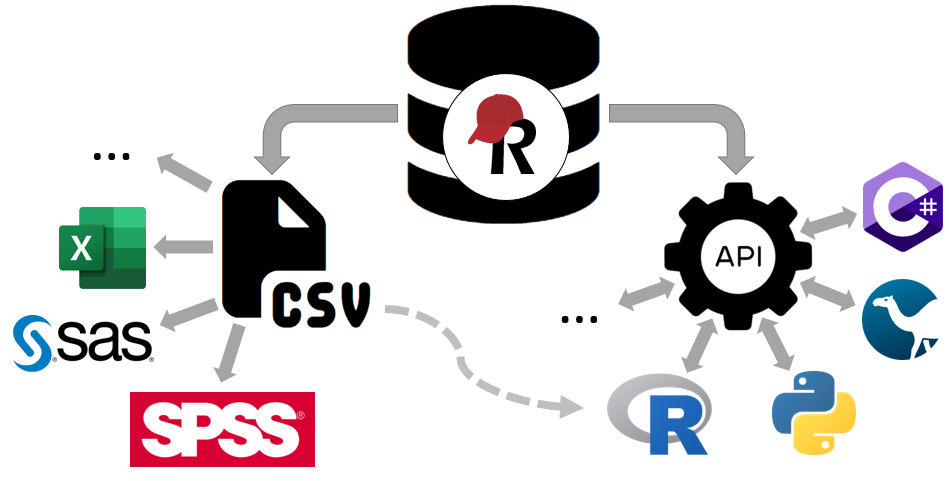

# Motivation

## Working with REDCap Data

- REDCap is widely used for data collection in clinical & research contexts
- Once collected, the real work begins: _**analysis**_
- Key question:  
  _How do you usually get your data out of REDCap?_

## CSV Export vs API Access - Two Different Worlds

### CSV Export
- Manual download from REDCap
- Creates a **static snapshot** of the data
- Can include **all data** or a defined subset (report)
- Good for **one-time analyses** or data sharing
- No programming skills required
- Easy to open in Excel, SPSS, SAS, ...

### API Access
- Connects directly to the REDCap project
- Always retrieves the **latest version** of the data
- Integrates into **R/Python scripts and workflows**
- Can also epxort reports programmatically
- Automates repetitive steps and reduces errors
- Ensures **reproducibility** through scripted pipelines

### Mixed / Hybrid Approach
- **Exported CSVs** can be used as input for scripted pipelines
- Allows combining manual exports with automated analysis steps
- Reports can be exported both manually or via the API → more control from REDCap side
- Programmatic pipelines still ensure reproducibility

## The Concept of Living (Meta)Data

- REDCap projects **evolve continuously**:
  - New participants enrolled
  - Existing records updated
  - Data quality issues corrected*
  - **New fields or forms added** over time
- **CSV Export**
  - Provides only a **static snapshot** of data and metadata
  - Must be re-downloaded whenever project structure or data changes
  - Risk of outdated or inconsistent files
- **API Access**
  - Always pulls the latest data and metadata
  - Integrates directly into scripted workflows**
  - Supports reproducibility and automation even as the project changes**

\* These issues could very well be detected through analyses _outside_ of REDCap  
\*\* Of course, metadata changes may required the scripted pipeline to be adapted

## Why do we care?

### Reproducibility & Transparency

- Data analyses should be:
  - _Reproducible_: same script = same results, anytime
  - _Transparent_: clear documentation of steps
- Using R scripts with API pulls:
  - analysis becomes a documented pipeline,
  - easier to share with collaborators,
  - simpler to audit or reproduce months later.

### Quality & Efficiency Benefits

- Automated API workflows reduce risk of:
  - Using the wrong/outdated CSV version
  - Manual copy-paste errors
- Type consistency & controlled variable names directly from Codebook/API.
- Early data quality checks possible (missing data, unexpected values, etc.).

---

Thus, while CSV exports will always remain a valuable option, especially for quick checks, simple analyses, or collaboration with colleagues who prefer spreadsheets, they quickly reach their limits in projects where data and metadata keep evolving and frequent analyses need to be performed. 

REDCap projects can be considered "living systems": both, data and metadata change over time. To keep up with these changes, reproducibility and automation become essential. Programmatic access via the API provides a reliable way to ensure that both data and metadata are always current, and that every step of the analysis can be repeated without guesswork.