Accessing REDCap Data via the API: Prerequisites
==============

## REDCap Projects and Data Organization

- **Fields** (Variables)
  - Basic units of data (e.g., age, blood pressure, diagnosis)
  - Each field has a **type** (text, number, date, multiple choice, etc.)
- **Instruments** (Forms)
  - Simply a **collection of fields**
  - Used for data entry or surveys
- **Classic projects**
  - One timeline (one "arm" with one event; not visible in the UI)
  - Data organized by instruments
  - Instruments can be **repeatable**
- **Longitudinal projects**
  - One or more arms with **events** (timepoints)
  - Instruments assigned to one or multiple events 
  - Instruments/events can be **repeatable** (but instruments cannot repeat on repeating events)
- **For data analysts**
  - Understanding project structure is essential
  - Access may be **via API key** without REDCap login

  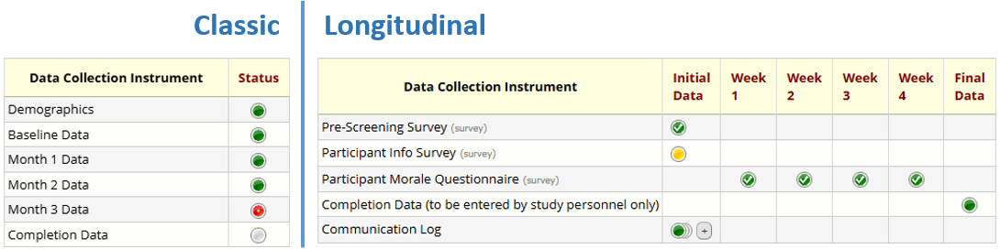

## Metadata: Data Dictionary and Codebook

- **Data Dictionary**
  - CSV file describing all fields in a project
  - Includes field names, types, choices, validation rules
  - Downloadable from project setup page (requiers _Project Design and Setup_ right) or **API** ("Export Metadata")
- **Codebook**
  - Rich, human-readable view of project metadata
  - Shows instruments, events (in longitudinal projects), and repeatability
  - Includes list of missing data codes, if defined
  - Features: search within REDCap, or save/export as PDF for offline use
  - The results of _several_ API methods have to be combined to obtain the information contained in the Codebook (e.g., "Export Project Info" for missing data codes)
- **Why is this important for analysts?**
  - Metadata defines the **meaning of data fields**, including coding of categorical choices and labels or annotations that specify units for numerical data
  - Essential for data quality checks and interim analyses
  - Needed to keep up with changes in "living (meta)data"

Data Dictionary, viewed in VS Code

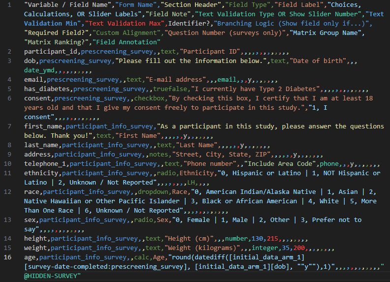

Codebook (viewed inside REDCap)

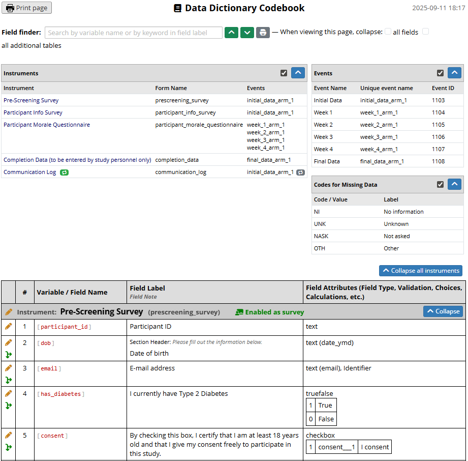

## User Rights – Viewing vs Export Rights

- **Viewing Rights**
  - Apply when logged into REDCap's web interface
  - Define which records and fields a user can see on forms or reports
- **Export Rights**
  - Apply when downloading data or using the API
  - Control the **level of detail** that can leave REDCap

**Export Rights Levels**
- **No Access** → user cannot export data
- **De-Identified** → removes direct identifiers, all dates, and all notes and unvalidated text fields
- **Remove All Identifier Fields** → strips fields marked as identifiers
- **Full Data Set** → no restrictions

_A note on **Data Access Groups**:_ Users who are in a DAG only ever can access records in that DAG. Data analysts (usually) need to get data from all DAGs, and thus they are (usually) not in a DAG.

The screenshot below shows the part of the User Rights dialog that sets data viewing and export rights. As shown, these might be the rights assigned to a statistician who does not normally log into REDCap but accesses data using the API only.

## Reports in REDCap

- **Reports = custom data views**
  - Define subsets of fields (and records, when filtering)
  - Useful for scoped analyses where not all data is required
- **Access considerations**
  - Reports respect user **viewing** rights when viewed inside REDCap
  - Reports respect **export** rights when exporting the data
  - Access to a specific report can be limited to certain users/roles in the report settings 
  - Data Access Group restrictions are always observed
- **Exports**
  - Reports can be downloaded as CSV
  - Reports can also be exported programmatically via the **API** ("Export Reports")

Given the user rights shown above, a user viewing a report while logged into REDCap will no see any data:

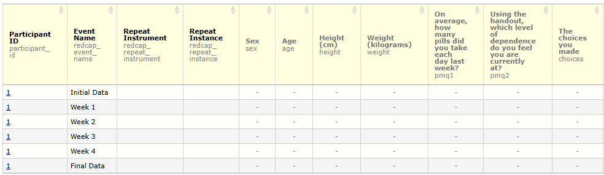

However, that same report, exported as a CSV (either by downloading it, or by using the "Export Report" API method), will contain the data:

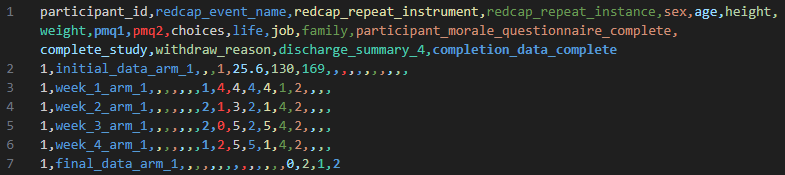

Note: When exporting **de-identified** data from a report via CSV download, date field can either be removed or date-shifted. This option is not available for API exports, where date fields are always removed. 

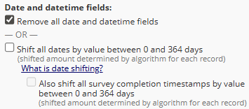

Below, line 7 of the CSV with date-shifted values is shown.

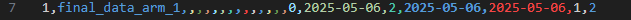

**Tip:** Take this into account when planning an analyses that needs to take date differences into account and not using the **de-identified** export right is not an option _and_ the export needs to be performed with the API. A workaround would be to calculate differences between dates in REDCap and exporting those instead of the actual date fields.

## Introduction to the REDCap API

- **What is the API?**
  - A set of endpoints to access REDCap data and metadata programmatically
  - Enables integration with R, Python, and other tools
- **API User Rights**
  - Separate from data export rights
  - Key options:
    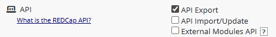
    - **Export** (read data/metadata)
    - **Import/Update** (write data)
    - **External Modules API** (access EM-provided methods)
- **API, API Playground, and API Documentation**
  - Accessible from the _Applications_ menu:
    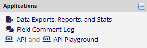
  - Allows to request and then view/mangage the API token
  - Show available methods
  - Provide interactive examples for testing (read/write in development projects, read only in production projects)
  - Provides concrete code snippets for various programming languages

    Screenshot of a user's API management page in a project:
    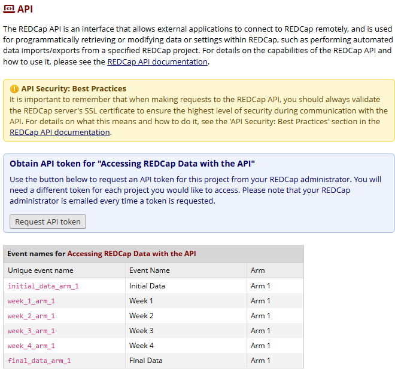

    Once an API token has been created, it can be viewed and managed:
    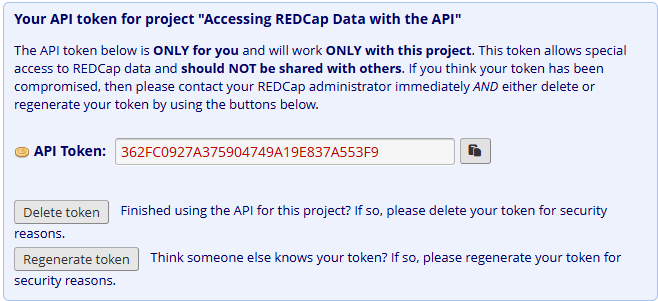

    Interactive API method calls executed in the API Playground are shown as code:
	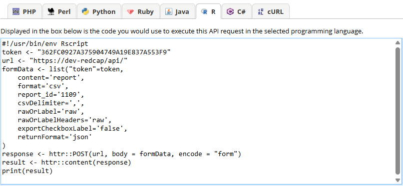

- **API Tokens**
  - Unique key linked to a specific **user _and_ project**
  - Grants access according to that user’s rights
  - Must be kept **secure** (details on token handling will follow later)

**Tip**: If you are a data analyst without access to the production REDCap project but need to learn how the REDCap API works, ask for access to a demo or test project. This allows you to safely “play around” and practice API calls without risking production data.

## Prerequisites on the Analyst’s Side (R)

- **R Installation**
  - Install the latest version of R (and optionally RStudio IDE)
- **Network Connectivity**
  - Ensure your machine can reach the REDCap API endpoint
  - Example: `https://redcap.domain.name/api/`
- **API Token**
  - Personal key tied to user + project
  - Required for all API calls
- **R Packages**
  - While not strictly required, install packages that abstract away a lot of the low level REDCap API interactions and data transformations, such as, e.g.,
    - redcapAPI
    - REDCapR
    - REDCapTidieR
- **Recommended IDE Enhancements**
  - Code completion and linting (e.g., `languageserver`, `lintr`)
  - Syntax highlighting for JSON/CSV
  - Git integration for version control
  - Notebook-style workflow (e.g., R Markdown or Quarto) for combining code, results, and documentation

With these prerequisites in place — understanding how REDCap organizes its data and metadata, knowing how user rights shape what can be exported, and setting up your own R environment with the necessary tools — you are ready to move from theory to practice. In the next section, we will take a closer look at the available R packages for interacting with the REDCap API and see how they can streamline your analysis workflows.
