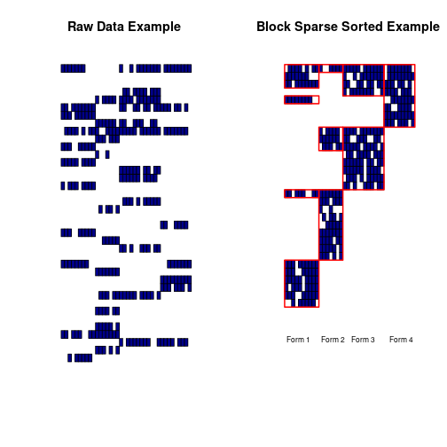

## Type Casting

One of the major benefits of utilizing a pre-existing package like `REDCapR` or `redcapAPI` is the amount of reuseable code that has gone into it's design. In the heart of these packages something known as 'type casting' occurs and it is a central concept which contains a large amount of value added. 

Type casting is the conversion from one data type into another in the computer. All data coming from REDCap is a character based string, and R has a variety of data types utilized in analysis, e.g. numeric or factor. A naïve idea would be that when given a string "123" it going to be easy to convert into a numeric in R. For that specific string it is, but there are a huge number of concerns that lurk within that. Next up, a short aside on just how theoretically deep those waters are and a follow up of the practicalities in the context of REDCap: NA's, validation, casting and user choice.

The following theory is included to show the theoretical depth of type conversion and can be safely skipped over. 

$f : A \rightarrow B$ denotes a function, $f$ in type theory that converts something of type $A$ into something of type $B$. The value of automatically evaluating and checking this has become very important in computer science. However, the idea has become even more important in mathematics. Betrand Russell published *Principia Mathematica* in 1910 seeking to find a single foundation for all of mathematics. He settled on set theory and it had 18 axioms, small formal assumptions, which it was based on. In this system it takes about 300 pages of math to show that 1+1=2. Godel's famous incompleteness theorem in 1929 was a huge blow to the goals of finding a single system that all mathematics could be based upon--as any such system must forever remain incomplete. Type theory in computers began making theoretical advances in the 1960's, a system Russell had initially considered. Voevodsky in 2006 showed a homotopy between lambda calculus, algebraic topology and type theory which is now call homotopy type theory (HoTT). In this foundation only 2 axioms were required to bootstrap mathematics and a short few pages to show 1+1=2. Russell's vision from a century before has been realized. On of those axioms, is the existence of a path between two points $A$ and $B$ which is represented by $f : A \rightarrow B$, thus making type casting one of the deepest philosophical entities in mathematics!

Fortunately, our needs are not as lofty and more direct. Type casting from REDCap concerns itself with 3 fundamental steps:

1. Is a value NA?
2. Is a value valid given it's specification in the REDCap data dictionary?
3. For values that are not NA and are valid, convert in memory to the computer's related type. 

Secondly, the inverse applies. Given a value in memory, type cast it down to a string that can be stored properly in REDCap. 

The libraries both make choices for the user that are the usual for 95% of the cases, but that doesn't mean those choices are what ones project needs. Thus inversion of control is provided such that the user can override these operations with their own.

## Sparse Block Matrix Form

## Checkboxes

With so many concerns handled in a consistent, repeatable manner by the libraries there still remains one difficult issue--that of the checkbox. 

The checkbox from a user experience using a form is a wonderful thing. A user can click/unclick a box and move on quickly. The root of the problem is that a checkbox *always* has a value--checked or unchecked. There is no idea of an NA. Just by including a checkbox on a form--it now by definition always has a value on that form. Couple this with the issue of detecting forms via sparse block matrices and whether a checkbox is NA is now dependent on the context in which it exists and it is not uncommon to define it as NA when all the other fields in the same form are NA or unchecked if a checkbox. This presents contextual interpretation of a checkbox's value which is not a desirable thing.

Checkboxes are best avoided and a dropdown that has a yes/no in which a user explicitly enters a value is prefered. Thus a user has explicitly set the value and the interpretation is clear.